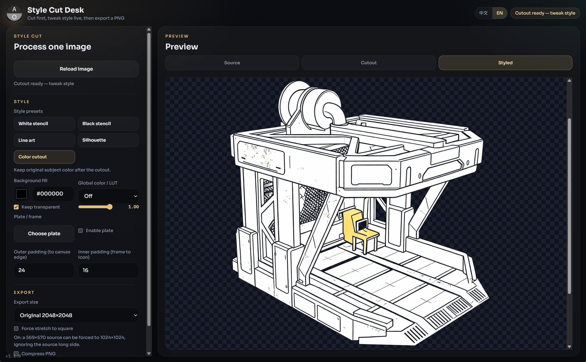

# 风格挖图台

**由安溯媒体打包**

本地桌面工具：先挖掉背景，再从预设库风格化透明件，最后按尺寸导出 PNG。

  

  <a href="#install">安装</a> ·
  <a href="#features">功能</a> ·
  <a href="#requirements">环境</a> ·
  <a href="#architecture">结构</a> ·
  <a href="#documentation">问答</a>

  

> [!NOTE]
> 这是独立新产品。它复用本地挖底流程，不会改 [Image Background Remover](https://github.com/axioxmedia/Image_Background_Remover) 仓库。

> [!WARNING]
> Windows EXE 是未签名的 PyInstaller 产物，首次打开可能被 SmartScreen 拦截。

Packed via Axiox Media · [axiox.media](https://axiox.media)
